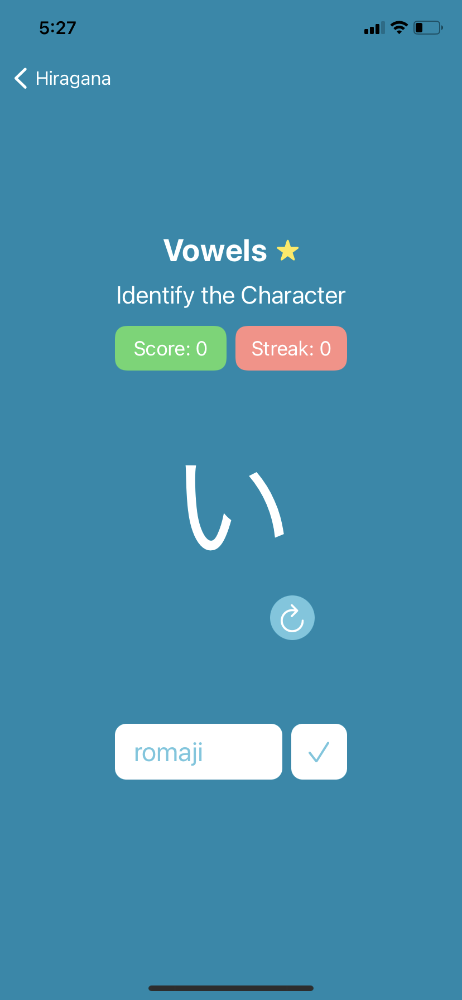
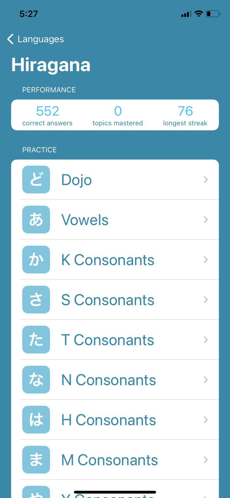

#  Hiragana Coach

    
    

## About
HiraganaCoach is an iOS app I developed so that I could learn a bit of Hiragana and Katakana. Initially it started off with just Hiragana, but then I added Katakana as well as some Zhuyin and Korean to it later on. Some key features of it include performance-tracking, such as the number of questions you've answered correctly in your lifetime, or your longest streak for a particular category. It also includes a recommendation system that biases towards characters you've missed the most, so that way you're able to get more familiar with the characters that you miss.

## Ingredients Used

- Swift
- SwiftUI
- CoreData
- [NotificationBanner](https://github.com/Daltron/NotificationBanner)

## Installation

I don't plan on releasing this project on the app store since it's purely for personal use. However, feel free to use it however you'd like.
